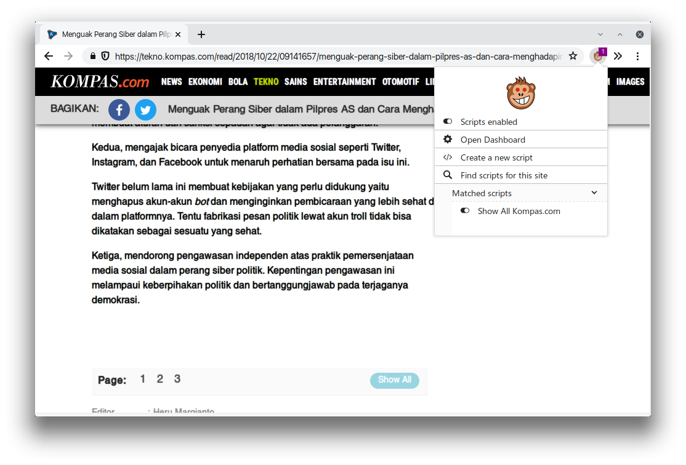

# kompas-show-all
Even though I knew TribunNews is part of Kompas Gramedia, I was surprised that Kompas sometimes split their page into multiple page just like TribunNews do. So this script automatically shows all the split page for Kompas.com.

## HOW TO USE
* Install a userscript manager. (Violentmonkey or Tampermonkey)
* Go to this [greasyfork](https://greasyfork.org/en/scripts/373617-show-all-kompas-com) page.
* Click the green button to install it and confirm the installation.
* Done.